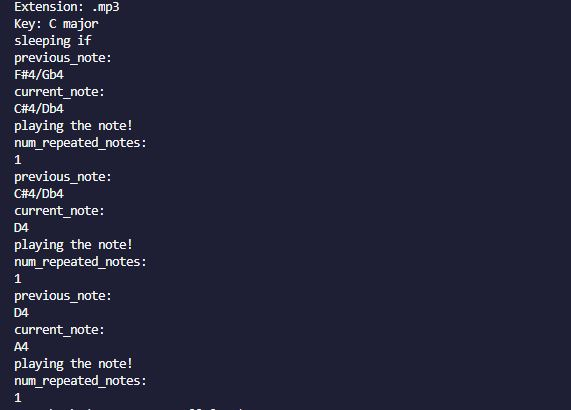

# 🎼 Digital Melodies: Crafting Music from Binary Code 🎶

Welcome to **Digital Melodies**! This project transforms binaries into captivating music.

## What's This All About?

At its core, this project explores the intriguing concept of utilizing the distinctive patterns found in binaries to create music. We take binary data, decipher its bytes, and translate them into musical notes.

## How It Works

1. **Read the Binary**: We initiate by extracting the bytes from a binary file.
2. **Map to Musical Notes**: Each byte is then meticulously assigned to a musical note within our range spanning from C0 to B8.
3. **Compose the Tune**: These mapped notes are artfully sequenced, resulting in an original piece of music inspired by the structure of the binary data.
4. **Play It Loud (or Soft)**: Finally, our script orchestrates these notes, bringing the data to life through captivating melodies!

## Developed Using:

These are Python library imports used for audio processing and other related tasks:

- `pydub`: A Python library for audio manipulation. It allows you to perform various operations on audio files like slicing, concatenation, conversion, etc.

- `AudioSegment`: This class is used for representing audio segments and performing various operations on them.

- `Sine`: A generator provided by pydub for creating sine wave audio.
  simpleaudio: Another Python library for playing audio. It provides simple methods for playing audio files or audio data directly from memory.

- `io`: This is a standard Python module providing facilities for working with I/O (input/output). In this context, it's likely used for handling file-like objects.

- `time`: A standard Python module providing various time-related functions. It's commonly used for measuring time elapsed during operations.

- `sys`: Another standard Python module providing access to some variables used or maintained by the Python interpreter and to functions that interact strongly with the interpreter. In this context, it might be used for system-specific parameters and functions.

- `argparse`: A standard Python module for parsing command-line arguments. It helps in building user-friendly command-line interfaces.

- `os`: Another standard Python module providing a portable way of using operating system-dependent functionality. It's used for tasks like file manipulation, directory operations, etc.

## Getting Started

1. Clone the repository to your local machine:

   <pre><code>git clone https://github.com/jvang0620/Digital-Melodies</code></pre>

2. Install necessarity packages:

   `python.exe -m pip install --upgrade pip`

   - This command invokes Python (python.exe) and instructs it to run the pip module with the install subcommand.
   - The --upgrade option tells pip to upgrade the specified package if it's already installed.
   - The package name specified here is pip itself, so this command upgrades the pip package to the latest version.

   `python -m pip install pydub`

   - This command invokes Python and instructs it to run the pip module with the install subcommand.
   - It installs the pydub package, which is a Python library for working with audio files.

   `python -m pip install simpleaudio`

   - Similar to the previous command, this installs the simpleaudio package, which is another Python library used for playing and recording audio.

In summary, these commands ensure that you have the necessary Python packages (pip, pydub, and simpleaudio) installed in your Python environment.

4.  Add any .mp3 files into folder within the root directory (mine is call `media`)
     

5.  Run application:

    - In the directory where your python file and .mp3s are located, type into the terminal:

      `python data_melodies_maker.py media/NAMEOFMP3FILEHERE.mp3`

         

    - Terminal will display something like this (\*Note: Processing time increases with the duration of the .mp3 file):

         

        

            
        

6.  Terminal output meaning:

- `Extension: ".mp3"` indicates that the input file format is MP3.

- `Key: "C major"` denotes that the key signature of the music being processed is in the key of C major.
- `current_note and previous_note`: These lines indicate the notes being played. For example, "current_note: C#4/Db4" means that the current note being played is C#4 or Db4, and "previous_note: F#4/Gb4" means that the previous note played was F#4 or Gb4.

- `playing the note!`: This line indicates that the application or script is playing the note specified.
- `num_repeated_notes`: This line indicates the number of times a note has been repeated.
- `sleeping if`: This line seems to suggest that the application or script is pausing before continuing to the next note.

Enjoy the beautiful digital melodies.

# 🎵 Digital Melodies 🎵
